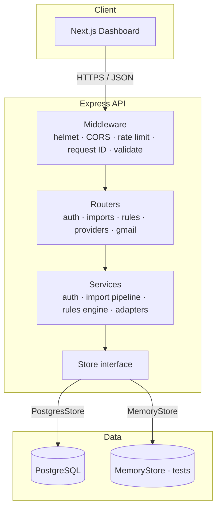
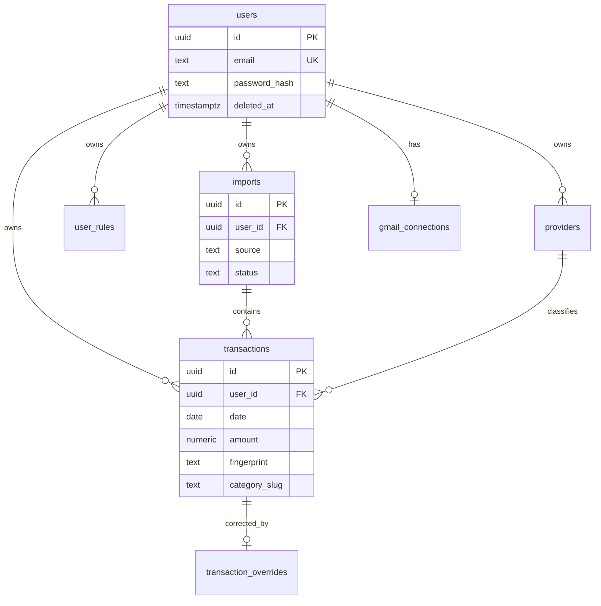

# Ledgerline

Private-beta **UPI expense product**: parse bank statement PDFs, persist per-user transactions, classify merchants/people with rules, and optionally backfill statements from Gmail.

Designed as a production-shaped system that can grow toward **100,000+ users** — clean layering, Postgres, versioned migrations, structured logging, validated config, rate limiting, and health probes — without unnecessary microservices complexity.

---

## Project overview

| Layer | Tech |
|--------|------|
| Frontend | Next.js 16 (App Router), React 19, Tailwind 4 |
| Backend | Node.js (ESM), Express 5, TypeScript |
| Database | PostgreSQL 16 (in-memory store for tests only) |
| Auth | Invite-only registration, bcrypt + JWT (Bearer) |

**Product capabilities**

1. Invite-only accounts with JWT sessions and account wipe
2. Authenticated PDF upload → parse (HDFC adapter) → fingerprint dedupe → persist
3. Dashboard analytics from stored transactions (month filter, top UPI handles)
4. User rules for people/merchant tracking + correction → future matching
5. Provider registry under lifestyle categories (food, outing, travel, …)
6. Optional Gmail `readonly` pooling scoped to **bank statement sender allowlist only**

Deep dive: **[docs/ARCHITECTURE.md](docs/ARCHITECTURE.md)** — table schema, category→provider model, pooling sequence, personal-use checklist.

---

## Architecture



**Request path:** Client → security headers / CORS → correlation ID → structured access log → rate limiter → Zod validation → router → service → `Store` repository → Postgres.

### Folder structure (backend)

```
backend/src/
  api/                 # Cross-cutting HTTP (health / live / ready)
  app.ts               # Express app factory
  index.ts             # Boot, graceful shutdown
  config.ts            # Zod-validated environment config (fail-fast)
  auth/                # Auth routes + JWT/bcrypt service
  accounts/            # Bank presets + statement sender allowlist
  imports/             # Upload/dashboard/correction routes + import service
  rules/               # Rule CRUD + matching engine
  providers/           # Provider registry
  gmail/               # OAuth, pooling, backfill, push jobs
  adapters/            # Bank PDF adapters (HDFC today)
  analytics/           # Aggregations from store
  parser/              # PDF text extraction + row parsing (parser.ts)
  crypto/              # AES-GCM secrets + fingerprints
  db/
    migrations/        # Versioned *.up.sql / *.down.sql
    seeds/             # Demo seed (non-production)
    migrator.ts        # Migration runner
    postgres.ts        # PostgresStore (pool + queries)
    memory.ts          # In-memory Store for tests
    types.ts           # Store contract (repository interface)
  errors/              # AppError + global handler
  logger/              # Pino JSON logger
  middleware/          # requestContext, logging, rateLimit, validate, security
  validators/          # Zod request schemas
  observability/       # Metrics-ready counters/histograms
```

Domain modules stay cohesive (routes + service next to each other). Cross-cutting concerns live in dedicated folders. The `Store` interface is the repository boundary — swap Memory ↔ Postgres without touching business logic.

---

## Design decisions & engineering trade-offs

### PostgreSQL vs MongoDB / document stores

| Option | Pros | Cons |
|--------|------|------|
| **PostgreSQL (chosen)** | Strong consistency, FKs, unique fingerprints, mature ops, SQL analytics | Schema migrations required |
| MongoDB | Flexible documents | Weak relational integrity for users→txns→rules; harder dedupe uniqueness |
| SQLite | Simple local | Weak concurrent write story for multi-tenant API |

**Selected:** PostgreSQL. Expense data is relational (users, imports, transactions, rules) with uniqueness and FK constraints. Prefer Mongo when the primary model is opaque nested documents with rare joins.

### Repository (`Store`) vs direct ORM usage

| Option | Pros | Cons |
|--------|------|------|
| **Store interface (chosen)** | Testable with MemoryStore; hides SQL; clear tenancy boundary | Hand-written SQL; more boilerplate |
| Prisma / Drizzle | Migrations + types out of the box | Heavier dependency; MemoryStore testing harder |
| Raw `pg` in routes | Fast to write | Leaks data access into HTTP layer |

**Selected:** Explicit `Store` repository. Ideal while the surface is moderate. Revisit Drizzle if query volume and schema churn grow.

### Migration tool

| Option | Pros | Cons |
|--------|------|------|
| **Lightweight SQL migrator (chosen)** | Zero ORM lock-in; clear up/down files; transactional apply | No auto-diff from models |
| node-pg-migrate / Flyway | Battle-tested | Extra tooling |
| Prisma migrate | Great DX with Prisma | Couples to Prisma |

**Selected:** Numbered `.up.sql` / `.down.sql` plus `schema_migrations` table. Enough for this scale; switch to a dedicated tool when multiple engineers ship schema daily.

### Logger (Pino)

| Option | Pros | Cons |
|--------|------|------|
| **Pino (chosen)** | Fast JSON logs, redaction, child loggers, ecosystem | Pretty-print needs `pino-pretty` in dev |
| Winston | Flexible transports | Slower default path |
| `console.*` | Simple | Not production-queryable |

**Selected:** Pino with request IDs and field redaction. Use OpenTelemetry logs exporter later if the platform standardizes on OTLP.

### Validation (Zod)

Already a dependency; schemas validate config **and** requests. Alternatives (Joi, celebrate) add another library without clear benefit.

### Rate limiting (`express-rate-limit`)

In-process, IP- and user-keyed limits with burst windows. **Advantage:** zero infra. **Disadvantage:** not shared across API replicas. Prefer Redis-backed store (or API gateway limits) once you run multiple instances.

### Architecture style

Modular monolith (domain folders + shared infrastructure) over microservices. At &lt;100k users a single well-hosted API + Postgres is simpler to operate. Split Gmail workers or parse workers only when CPU/queue latency demands it.

---

## Database schema

Core entities (UUIDs, FKs, indexes — see migrations `001_initial` + `002_bank_mail_and_pooling`, and [docs/ARCHITECTURE.md](docs/ARCHITECTURE.md)):



**Notable constraints**

- `UNIQUE (user_id, fingerprint)` — idempotent imports
- `UNIQUE (user_id, attachment_hash)` / Gmail message id — attachment dedupe
- Partial index on active users; indexes on `(user_id, date)`, category, UPI, provider
- Soft-delete users (`deleted_at`); hard-delete tenant data on account wipe (transactional)

---

## API documentation

Base URL: `http://localhost:4000`

**Error envelope**

```json
{
  "error": {
    "code": "VALIDATION_ERROR",
    "message": "Request validation failed",
    "requestId": "…",
    "details": [{ "path": "email", "message": "Invalid email" }]
  },
  "detail": "Request validation failed"
}
```

(`detail` is kept for older clients.)

| Method | Path | Auth | Purpose |
|--------|------|------|---------|
| GET | `/health` or `/api/health` | no | Aggregate health |
| GET | `/live` | no | Liveness |
| GET | `/ready` | no | Readiness (DB ping) |
| POST | `/api/auth/register` | no | Invite registration |
| POST | `/api/auth/login` | no | Login → JWT |
| GET/DELETE | `/api/auth/me` | Bearer | Profile / wipe data |
| POST | `/api/parse` | Bearer | Upload + persist statement |
| GET | `/api/imports/dashboard` | Bearer | Aggregated dashboard |
| GET | `/api/imports/` | Bearer | List imports |
| POST | `/api/imports/upload` | Bearer | Alt upload path |
| PATCH | `/api/imports/transactions/:id` | Bearer | Correct txn (+ optional future rule) |
| GET/POST | `/api/rules` | Bearer | List / create rules |
| DELETE | `/api/rules/:id` | Bearer | Delete rule |
| GET | `/api/rules/suggestions` | Bearer | Counterparty suggestions |
| GET/POST | `/api/providers` | Bearer | Provider registry |
| * | `/api/gmail/*` | mostly Bearer | Connect, backfill, sync, push |

Rate limits (configurable): global ~120/min/IP, auth ~20/min/IP, uploads ~15/min/user.

---

## Local setup

```bash
# Postgres
docker compose up -d postgres

# Backend
cd backend
cp .env.example .env
# Edit JWT_SECRET / ENCRYPTION_KEY for anything beyond throwaway local use
npm install
npm run migrate
npm run dev

# Frontend
cd frontend
npm install
npm run dev
```

- Frontend: http://localhost:3000  
- Backend: http://localhost:4000  
- Default invite: `beta-ledgerline`

For tests without Postgres: `DATABASE_URL=memory`.

### Environment variables

| Variable | Required | Description |
|----------|----------|-------------|
| `DATABASE_URL` | prod | Postgres URL (`memory` forbidden in production) |
| `JWT_SECRET` | yes | ≥16 chars; insecure defaults blocked in production |
| `ENCRYPTION_KEY` | yes | 64 hex chars (32-byte AES key) |
| `CORS_ORIGINS` | yes | Comma-separated allowlist |
| `FRONTEND_URL` | yes | Used for Gmail OAuth redirects |
| `INVITE_CODES` | no | Comma-separated bootstrap invites |
| `PORT` | no | Default `4000` |
| `LOG_LEVEL` | no | `debug` \| `info` \| `warn` \| `error` … |
| `LOG_PRETTY` | no | `1` for human-readable logs in development |
| `RATE_LIMIT_*` | no | Window/max thresholds |
| `DB_POOL_*` | no | Pool size / timeouts |
| `GOOGLE_*` / `GMAIL_PUBSUB_TOPIC` | no | Gmail OAuth + Pub/Sub |

### Running migrations

```bash
cd backend
npm run migrate          # apply pending *.up.sql
npm run migrate:down     # roll back latest *.down.sql
npm run seed             # demo providers + invites (non-prod only)
```

Migrations apply automatically on API boot as well.

### Running tests

```bash
cd backend
npm test                 # parser smoke + product (auth, tenancy, dedupe, rules)
```

---

## Deployment guide

1. Provision managed Postgres 16; set strong `JWT_SECRET` / `ENCRYPTION_KEY`.
2. Set `NODE_ENV=production`, `DATABASE_URL`, `CORS_ORIGINS`, `FRONTEND_URL`.
3. Build & run API:

```bash
cd backend && npm ci && npm run build && npm start
# or
docker compose up --build api postgres
```

4. Deploy frontend (`NEXT_PUBLIC_API_URL` → API origin) behind HTTPS.
5. Point load balancer health checks at `/ready` (readiness) and `/live` (liveness).
6. Ship Gmail only after Google OAuth verification for restricted scopes.

**Graceful shutdown:** SIGTERM/SIGINT close the HTTP server and drain the Postgres pool.

---

## Scaling considerations

| Concern | Current | Next step at ~100k users |
|---------|---------|---------------------------|
| API instances | Single process rate limits | Redis store for rate limits; sticky-free JWT |
| DB | One Postgres, pool max 20 | Connection pooler (PgBouncer), read replicas for dashboard |
| Imports | Sync PDF parse in request | Job queue (BullMQ/SQS) for large PDFs |
| Dashboard | Loads user transactions in memory | SQL aggregations + pagination / date ranges |
| Gmail | In-process timers | Dedicated worker + Pub/Sub verification |
| Files | Multer memory (25MB) | Stream to object storage; virus scan |

Horizontal scale of the API is straightforward once rate limiting and sessions are externalized; the first bottleneck is usually **per-user transaction volume** on dashboard aggregation, not request QPS.

---

## Monitoring strategy

- **Probes:** `/live`, `/ready`, `/health`
- **Logs:** JSON via Pino → ship to CloudWatch / Datadog / Loki; correlate with `X-Request-Id`
- **Metrics:** `observability/metrics.ts` counters/histograms (HTTP, imports, auth, DB errors) — ready to swap for Prometheus or OpenTelemetry
- **Alerts (recommended):** elevated 5xx rate, readiness failures, pool exhaustion, disk on Postgres, auth 401/429 spikes

Optional OpenTelemetry: add `@opentelemetry/sdk-node` when your platform already collects OTLP; avoid bolting it on before an exporter destination exists.

---

## Logging strategy

| Level | Use |
|-------|-----|
| `debug` | Verbose parse / adapter detail |
| `info` | Boot, migrations, successful requests |
| `warn` | 4xx, validation, rate limits |
| `error` | 5xx, DB/pool failures, unhandled |

Redacts `authorization`, passwords, tokens. Every response includes `X-Request-Id`.

---

## Security considerations

- Helmet security headers; CORS allowlist; `x-powered-by` disabled
- Zod validation on bodies/params; parameterized SQL (no string-concat queries)
- bcrypt cost 12; JWT HS256 (rotate secret on breach); AES-256-GCM for OAuth tokens
- Production refuses memory DB and known-insecure secrets
- Rate limits on auth and uploads
- Gmail push webhook still needs **Pub/Sub OIDC / token verification** before public exposure
- Frontend stores JWT in `localStorage` (XSS risk) — prefer httpOnly secure cookies for enterprise

---

## Production Readiness Report

### Remaining technical debt

1. Dashboard still aggregates in application memory (full txn list)
2. In-process rate limiting (not multi-instance safe)
3. Gmail `/push` lacks cryptographic verification
4. JWT in localStorage; 30-day expiry is long for high-security contexts
5. Single bank adapter (HDFC)
6. No CI workflow yet (GitHub Actions)
7. Script-style tests — not a full integration suite against Postgres
8. No virus/malware scanning on uploads
9. Account wipe soft-deletes user but leaves audit rows (by design) — document retention policy

### Future improvements

- Redis rate limit + session/blocklist
- Background job worker for PDF parse & Gmail sync
- SQL-side analytics + cursor pagination on transactions
- httpOnly cookie auth + refresh tokens
- OpenTelemetry traces + Prometheus `/metrics`
- Automated CI: `tsc`, `npm test`, migrate against ephemeral Postgres
- Additional bank adapters behind the same interface

### Scaling bottlenecks (100k users)

1. **Hot dashboards** for power users with years of UPI history  
2. **PDF CPU** on shared API pods during statement season  
3. **Postgres connections** without a pooler under many replicas  
4. **Gmail API quotas** if many users sync concurrently  

### Security considerations (summary)

Strong baseline for a private beta. Blockers for public enterprise: Gmail push auth, cookie-based sessions, secret management (KMS/SM), WAF/CDN, dependency scanning in CI, and Google restricted-scope verification.

### Readiness score for 100,000 users: **6.5 / 10**

Solid architecture and ops foundations (config, logs, errors, migrations, pooling, probes). Not yet enterprise-grade on multi-instance rate limits, async processing, SQL analytics, or auth transport. Enough for a careful private beta / early growth; not enough to “turn on” 100k overnight without the next-step items below.

### Recommended next steps (enterprise path)

1. Add CI + Postgres integration tests  
2. Redis-backed rate limiting and externalize config/secrets  
3. Move parse/Gmail to a worker queue  
4. Push aggregations into SQL; paginate APIs  
5. Migrate to httpOnly cookies + shorter-lived access tokens  
6. Verify Gmail push; complete Google OAuth assessment  
7. Add Prometheus/OTel and SLO-based alerting  
8. Load-test (k6) import + dashboard paths at target concurrency  

---

## License / status

Private beta — invite only. Gmail features require Google Cloud OAuth setup and compliance with restricted-scope rules.
